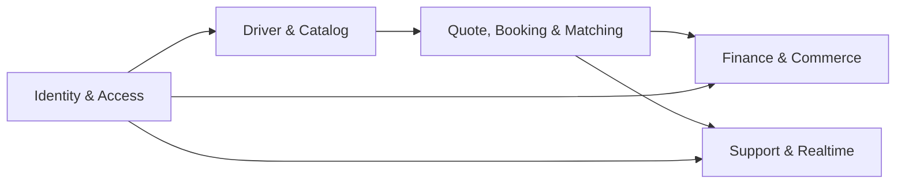
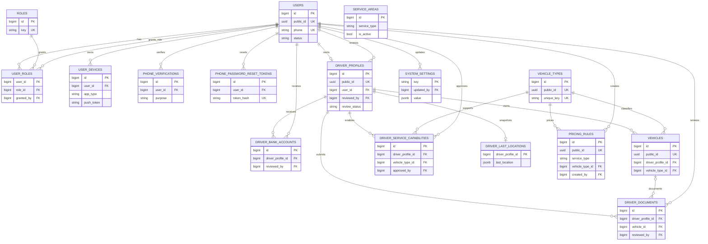
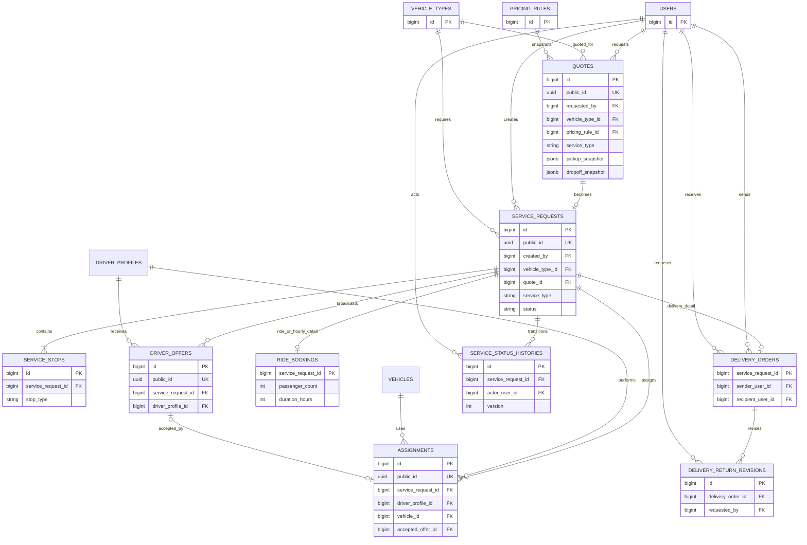
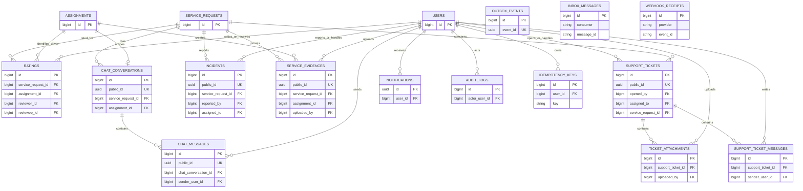

# ERD Triển Khai

> Nguồn chuẩn: `worker/database/migrations/`. Sơ đồ này mô tả schema hiện hành, gồm commerce/loyalty và dịch vụ `HOURLY`.

## Tổng quan domain

Khóa chính nội bộ dùng `id BIGINT`; resource public có `public_id UUID` khi cần lộ qua API. Các diagram chỉ nêu cột khóa/foreign key và các cột nghiệp vụ quyết định quan hệ.

## Identity, Driver Và Catalog

## Quote, Booking Và Matching

`DELIVERY` có `DELIVERY_ORDERS`; `DRIVE` và `HOURLY` dùng `RIDE_BOOKINGS`. `HOURLY` chỉ bắt buộc pickup, `duration_hours` từ 1 đến 12 và quote có `dropoff_snapshot = NULL`.

## Finance, Voucher Và Loyalty

```mermaid
erDiagram
  USERS { bigint id PK }
  LEDGER_ACCOUNTS { bigint id PK uuid public_id UK bigint owner_user_id FK string code UK }
  WALLETS { bigint id PK uuid public_id UK bigint user_id FK bigint ledger_account_id FK }
  LEDGER_TRANSACTIONS { bigint id PK uuid public_id UK string idempotency_key UK }
  LEDGER_ENTRIES { bigint id PK bigint ledger_transaction_id FK bigint ledger_account_id FK }
  PAYMENTS { bigint id PK uuid public_id UK bigint service_request_id FK bigint payer_user_id FK bigint customer_payment_ledger_id FK }
  VOUCHERS { bigint id PK uuid public_id UK bigint created_by FK bigint owner_user_id FK string code UK }
  VOUCHER_REDEMPTIONS { bigint id PK bigint voucher_id FK bigint user_id FK bigint service_request_id FK }
  DISCOUNT_TRANSACTIONS { bigint id PK uuid public_id UK bigint payment_id FK bigint voucher_redemption_id FK }
  SETTLEMENTS { bigint id PK uuid public_id UK bigint payment_id FK bigint assignment_id FK bigint driver_profile_id FK bigint earning_ledger_id FK bigint platform_fee_ledger_id FK }
  SETTLEMENT_REVISIONS { bigint id PK bigint settlement_id FK bigint ledger_transaction_id FK bigint approved_by FK }
  WALLET_TOPUPS { bigint id PK uuid public_id UK bigint wallet_id FK }
  WITHDRAWAL_REQUESTS { bigint id PK uuid public_id UK bigint wallet_id FK bigint driver_bank_account_id FK bigint handled_by FK bigint ledger_transaction_id FK }
  REFUNDS { bigint id PK uuid public_id UK bigint payment_id FK bigint requested_by FK bigint approved_by FK bigint ledger_transaction_id FK }
  COD_ACCOUNTS { bigint id PK bigint delivery_order_id FK bigint driver_profile_id FK }
  COD_TRANSACTIONS { bigint id PK bigint cod_account_id FK bigint actor_user_id FK }
  LOYALTY_ACCOUNTS { bigint id PK uuid public_id UK bigint user_id FK string tier }
  LOYALTY_REWARDS { bigint id PK uuid public_id UK bigint created_by FK int points_cost }
  LOYALTY_TRANSACTIONS { bigint id PK uuid public_id UK bigint user_id FK string idempotency_key UK }

  USERS ||--o{ LEDGER_ACCOUNTS : owns_optional
  USERS ||--o{ WALLETS : owns
  LEDGER_ACCOUNTS ||--o| WALLETS : backs
  LEDGER_TRANSACTIONS ||--|{ LEDGER_ENTRIES : posts
  LEDGER_ACCOUNTS ||--o{ LEDGER_ENTRIES : receives
  SERVICE_REQUESTS ||--|| PAYMENTS : pays
  USERS ||--o{ PAYMENTS : pays_for
  LEDGER_TRANSACTIONS o|--o{ PAYMENTS : customer_payment
  USERS ||--o{ VOUCHERS : creates
  USERS ||--o{ VOUCHERS : owns_reward
  VOUCHERS ||--o{ VOUCHER_REDEMPTIONS : redeems
  USERS ||--o{ VOUCHER_REDEMPTIONS : uses
  SERVICE_REQUESTS ||--o| VOUCHER_REDEMPTIONS : applies
  PAYMENTS ||--o| DISCOUNT_TRANSACTIONS : discounts
  VOUCHER_REDEMPTIONS ||--o| DISCOUNT_TRANSACTIONS : records
  PAYMENTS ||--o| SETTLEMENTS : settles
  ASSIGNMENTS ||--o| SETTLEMENTS : earns
  DRIVER_PROFILES ||--o{ SETTLEMENTS : receives
  LEDGER_TRANSACTIONS o|--o{ SETTLEMENTS : posts_earning
  SETTLEMENTS ||--o{ SETTLEMENT_REVISIONS : adjusts
  LEDGER_TRANSACTIONS o|--o{ SETTLEMENT_REVISIONS : records
  USERS ||--o{ SETTLEMENT_REVISIONS : approves
  WALLETS ||--o{ WALLET_TOPUPS : tops_up
  WALLETS ||--o{ WITHDRAWAL_REQUESTS : withdraws
  DRIVER_BANK_ACCOUNTS ||--o{ WITHDRAWAL_REQUESTS : receives
  USERS ||--o{ WITHDRAWAL_REQUESTS : handles
  PAYMENTS ||--o{ REFUNDS : refunds
  LEDGER_TRANSACTIONS o|--o{ REFUNDS : posts
  DELIVERY_ORDERS ||--o| COD_ACCOUNTS : tracks
  DRIVER_PROFILES ||--o{ COD_ACCOUNTS : holds
  COD_ACCOUNTS ||--o{ COD_TRANSACTIONS : records
  USERS ||--o{ COD_TRANSACTIONS : acts
  USERS ||--o| LOYALTY_ACCOUNTS : owns
  USERS ||--o{ LOYALTY_REWARDS : creates
  USERS ||--o{ LOYALTY_TRANSACTIONS : earns_or_redeems
```

`LOYALTY_TRANSACTIONS.reference_type/reference_id` là reference đa hình: service request khi earn, reward khi redeem và refund khi reverse. Voucher đổi điểm dùng `VOUCHERS.owner_user_id`, nên chỉ user sở hữu mới preview/redeem được.

## Support, Notification Và Integration

`AUDIT_LOGS`, `OUTBOX_EVENTS`, `INBOX_MESSAGES`, `IDEMPOTENCY_KEYS` và `WEBHOOK_RECEIPTS` là bảng integration/technical. Reference `aggregate_type + aggregate_id`, `subject_type + subject_id`, `resource_type + resource_id` được validation ở application layer nên không có đường FK tổng quát trên ERD.

## Ràng Buộc Không Thể Hiện Chỉ Bằng FK

| Quy tắc | Cơ chế thực thi |
|---|---|
| Một assignment `ACTIVE` cho mỗi request và mỗi driver | Partial unique index PostgreSQL |
| Một pickup; delivery/drive có một dropoff | Unique `(service_request_id, stop_type)` + validation service |
| Quote chỉ tạo một service request | `service_requests.quote_id UNIQUE` |
| Payment/settlement/discount transaction một-một | Unique foreign key tương ứng |
| Ledger debit bằng credit | `LedgerService` + feature test |
| Voucher owner chỉ dùng voucher của chính mình | `VoucherPreviewService` |
| Loyalty không âm và redeem idempotent | Transaction, row lock `loyalty_accounts`, unique idempotency key |
| `HOURLY` chỉ pickup, 1-12 giờ và feature flag | Request validation + pricing/booking service |

## Bảng Framework Ngoài ERD

Laravel/Sanctum tạo thêm `personal_access_tokens`, `jobs`, `job_batches`, `failed_jobs`, `cache` và migration metadata. Chúng là bảng hạ tầng, không phải quan hệ nghiệp vụ chính nên được giữ ngoài sơ đồ.
